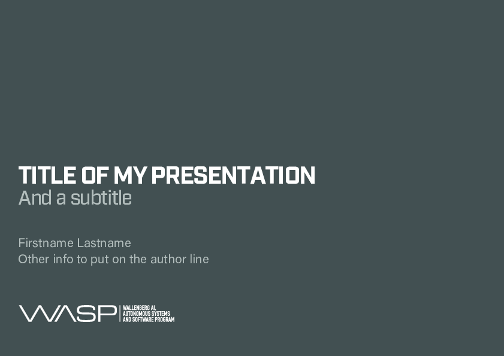
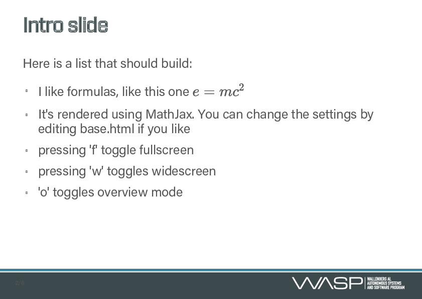

# Slidedeck: HTML5 Slideshows in markdown

## Overview

This is a fork from [rmcgibbo/slidedeck](https://github.com/rmcgibbo/slidedeck) adapted with a  template.

This is in turn a repackaging of the google io 2012 slidedeck, with [some](https://github.com/francescolaffi/elastic-google-io-slides) modifications, to be a little easier to use and more suitable for scientific presentations.

We've made a few changes:

- You edit and author your entire presentation in markdown.
- All the metadata about your project is set within the markdown file, including things like
  the title and author.
- It's packaged as a python project.
    - You run `slidedeck create` to make a new deck. This will create a new directory with your
      project. In particular, there will be a fine in there called `slides.md` that contains the
      markdown source for your slides.
    - `slidedeck render` will render your deck from markdown to html5.
    - `slidedeck watch` will watch your project and rerender the slides whenever you change the
       content (useful for iterative development).
- I made a few stylistic changes to the css, including changing the font size.
- The slides can contain LaTeX, which is rendered via mathjax.
- There are no google logos all over the place
- You will need the WASP fonts installed on your system.


## Getting started

`slidedeck` can be installed with `pip`, but you won't get the WASP template that way. Clone and install with `python`.

```
$ python setup.py install
```

Create a new project, complete with some template slides, the css, and the javascript.

```
$ slidedeck create my_slides
```

Look in there for the `slides.md` file, and edit it to your liking. When you want to see your work, compile the slides from markdown into HTML.

```
$ slidedeck render
```


You can also have the HTML *auto-compiled* from markdown, any time the files change on disk.
```
$ slidedeck watch
```

If you're curious about how any of these commands work, pass the `-h` flag to the command
line executable,

```
$ slidedeck -h
$ slidedeck create -h
```

## Tricks

`slidedeck watch` works nicely with the [tincr](http://tin.cr/) extension for
chrome, which will refresh your browser every time the html files its serving
are changed on disk.  

Use `knitr` to compile RMarkdown to Markdown before rendering.

```
library(knitr); knit('slides.Rmd')
```

## Examples





## License

-------
```
            DO WHAT THE FUCK YOU WANT TO PUBLIC LICENSE
                    Version 2, December 2004

Everyone is permitted to copy and distribute verbatim or modified
copies of this license document, and changing it is allowed as long
as the name is changed.

            DO WHAT THE FUCK YOU WANT TO PUBLIC LICENSE
  TERMS AND CONDITIONS FOR COPYING, DISTRIBUTION AND MODIFICATION

0. You just DO WHAT THE FUCK YOU WANT TO.
```

